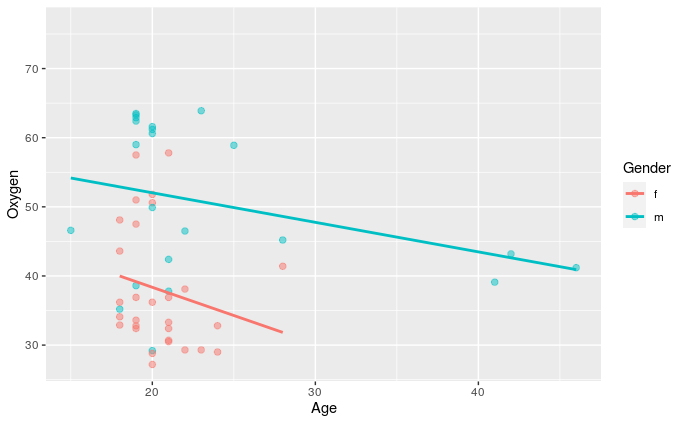
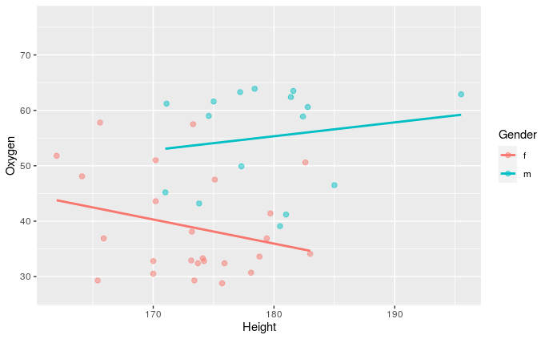
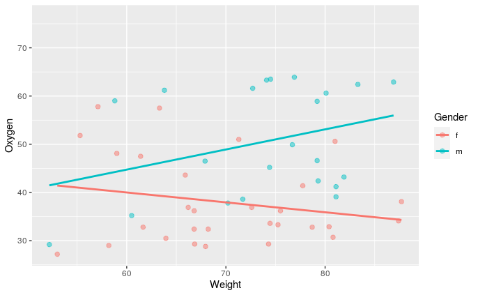
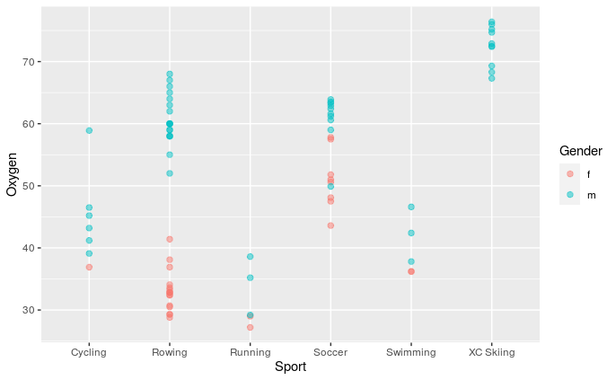
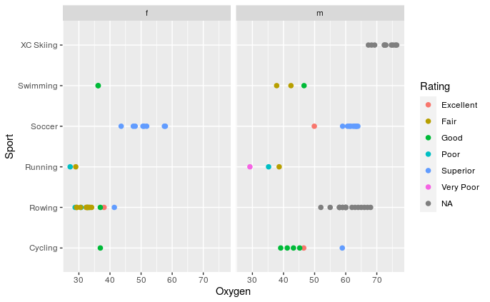
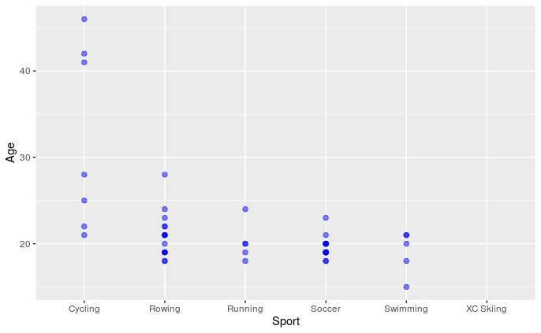
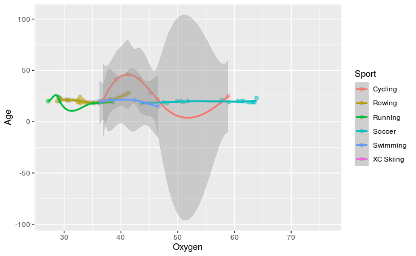

# VO2 Max Comparison Across Six Sports

**Author:** Agne Pack
**Tools:** R, ggplot2, dplyr (tidyverse)
**Type:** Independent statistical analysis (Data Science coursework, later cleaned up for portfolio use)

## Overview

This project investigates a common claim in exercise physiology literature: that
cross-country (XC) skiers post the highest VO2 max (maximal oxygen uptake) values
of any athletic population. Using published test-subject data compiled from six
sports — cycling, rowing, running, soccer, swimming, and XC skiing — I explored how
VO2 max relates to age, height, weight, and sport, and checked whether the XC skiing
claim held up against the data I could source.

## Purpose

1. Determine whether XC skiing shows the highest VO2 max values relative to other
   endurance and mixed-demand sports.
2. Examine how age, height, and weight relate to VO2 max, and whether those
   relationships differ by gender.
3. Surface data-quality issues (missing values, small sample sizes, gender imbalance)
   that limit how confidently conclusions can be drawn.

## Data & Sources

Individual-subject VO2 max testing data is rarely published due to participant privacy
agreements, so this dataset was assembled from published studies and normative
reference tables rather than a single clean source:

- Soccer VO2 max dataset — University of New Mexico, *UNM Digital Repository*.
  https://digitalrepository.unm.edu/cgi/viewcontent.cgi?article=1013&context=ume-research-papers
- Normative VO2 max reference table — machars.net.
  https://www.machars.net/v02max.htm
- Additional sport-specific figures drawn from published exercise-physiology literature
  reviewed as part of this project.

**Known limitations:** female representation is limited across all sports, especially
at older ages; age data is entirely missing for XC skiing; and sample sizes vary
substantially by sport (rowing and soccer have the most complete data; XC skiing has
the least).

## Method

Data was loaded into R as a single `Values` data frame with columns for `Oxygen`
(VO2 max), `Age`, `Height`, `Weight`, `Gender`, `Sport`, and a literature-derived
`Rating` (Poor → Superior) for each observation. Analysis used `ggplot2` for
visualization and `geom_smooth()` (linear and LOESS fits) to characterize trends.

```r
library(tidyverse)

# VO2 max vs. Age, by gender
ggplot(data = Values, mapping = aes(x = Age, y = Oxygen, color = Gender)) +
  geom_point(size = 2, alpha = 0.5) +
  geom_smooth(method = lm, se = FALSE)
```



For both males and females, VO2 max declines as age increases.

```r
# VO2 max vs. Height, by gender
ggplot(data = Values, mapping = aes(x = Height, y = Oxygen, color = Gender)) +
  geom_point(size = 2, alpha = 0.5) +
  geom_smooth(method = lm, se = FALSE)
```



```r
# VO2 max vs. Weight, by gender
ggplot(data = Values, mapping = aes(x = Weight, y = Oxygen, color = Gender)) +
  geom_point(size = 2, alpha = 0.5) +
  geom_smooth(method = lm, se = FALSE)
```



Height and weight correlate positively with VO2 max for males but negatively for
females in this dataset — likely a sampling artifact given how limited the female
data is, not a real physiological pattern.

```r
# VO2 max by sport, colored by gender
ggplot(data = Values, mapping = aes(x = Sport, y = Oxygen, color = Gender)) +
  geom_point(size = 2, alpha = 0.5)
```



```r
# VO2 max performance rating by sport, faceted by gender
Values %>%
  ggplot(aes(Oxygen, Sport, color = Rating)) +
  geom_point(size = 2) +
  facet_wrap(~Gender)
```



```r
# Age distribution by sport
ggplot(data = Values, mapping = aes(x = Sport, y = Age)) +
  geom_point(size = 2, color = "blue", alpha = 0.5)
```



```r
# Oxygen vs. Age, colored by sport, with LOESS smoothing
Values %>%
  ggplot(aes(Oxygen, Age, color = Sport)) +
  geom_point(size = 2, alpha = 0.5) +
  geom_smooth()
```



## Key Findings

- **Age:** For both genders, VO2 max declines as age increases — consistent with
  established exercise-physiology literature.
- **Height & weight:** Surprisingly, height and weight correlated *positively* with
  VO2 max for males but *negatively* for females. Given how sparse the female sample
  is — particularly at older ages — this is more likely a sampling artifact than a
  physiological effect.
- **Sport comparison:** XC skiing showed the highest VO2 max values of any sport in
  this dataset, consistent with prior literature. Soccer was the standout surprise —
  its VO2 max values rated "Superior" on the same scale as XC skiing.
- **Range and variability:** Cycling showed the widest range in both VO2 max and age,
  including some notable outliers. Female soccer also showed a wide outlier range,
  while XC skiing and male soccer were the most tightly clustered.
- **Data completeness:** Rowing and soccer had the most complete records; XC skiing
  had no age data at all, which limits how confidently its rating could be assessed
  on an age-adjusted basis.
- **Underperformers:** Running and swimming — both traditionally strong endurance
  sports — rated surprisingly low on VO2 max in this dataset, likely reflecting
  sample composition rather than a real athletic pattern.

## Conclusions

The data support the literature consensus that XC skiing produces the highest VO2 max
values among the sports studied, but the evidence is weaker than it first appears:
XC skiing's age data was entirely missing, which prevented any age-adjusted
comparison and means its "Superior" rating rests on fewer controls than the other
sports. Soccer's unexpectedly strong showing is the most interesting result of the
analysis — worth a closer look with a larger, more representative sample rather than
treating it as a settled finding here.

The gender-based reversal in the height/weight relationships is the clearest signal
that this dataset's biggest limitation isn't the sports themselves — it's sample size
and gender balance. With so few female subjects, especially at higher ages, any
male/female comparison in this dataset should be treated as exploratory rather than
conclusive.

## References

Jones, A. M., Kirby, B. S., Clark, I. E., et al. Physiological demands of running a
2 hour marathon race pace.

Normative Data Table for VO2 Max. Retrieved from https://www.machars.net/v02max.htm

Soccer VO2 max dataset. *UNM Digital Repository*, University of New Mexico. Retrieved
from https://digitalrepository.unm.edu/cgi/viewcontent.cgi?article=1013&context=ume-research-papers
